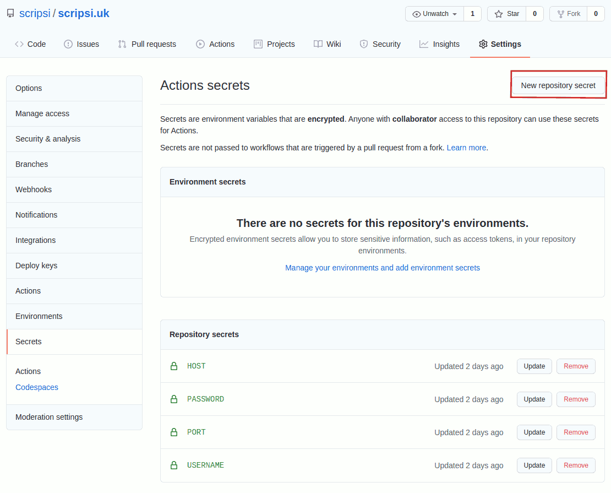

# scripsi.uk

This is the [scripsi.uk](http://scripsi.uk) website development repository.

The website content is written in Markdown and compiled to a static website with [MkDocs](https://www.mkdocs.org/) and the [Material for MkDocs](https://squidfunk.github.io/mkdocs-material/) theme. A GitHub Action compiles and deploys the website to hosting automatically whenever I use `git push` from my local copy.

This file just reminds me how things are configured and what to do to run the site.

## Configuration

The website includes a Python virtual environment that manages the dependencies. This is set up and managed by `pipenv`:

``` shell
# first time only - make a directory to hold the virtual environment
mkdir .venv

# run a command in the virtual environment non-interactively
pipenv run <command>

pipenv run mkdocs serve # <-- example

# activate an interactive virtual environment
pipenv shell

# finish with the virtual environment
exit

# install a dependency
pipenv install <module_name>

# check for security issues in dependencies
pipenv check

# update dependencies
pipenv update

# create a requirements.txt file
pipenv lock -r > requirements.txt

```

## Developing content

From the root of a local copy of the repository run (see above):

``` shell
pipenv run mkdocs serve
```

Open a web browser to [http://127.0.0.1:8000](http://127.0.0.1:8000)

Add and edit markdown files in the `docs/` folder and use the browser to view the changes.

A local copy of the website can be built for testing in the `site/` folder:

``` shell
pipenv run mkdocs build
```

 The `site/` folder is excluded from the repository in `.gitignore` so that it doesn't get uploaded to GitHub in a `git push`.

## Committing content

``` shell
git add .
git commit -m "commit message"
git push
```

## MkDocs plugins

The site uses a number of plugins for MkDocs:

### mkdocs-section-index

[https://oprypin.github.io/mkdocs-section-index/](https://oprypin.github.io/mkdocs-section-index/)

Standard MkDocs does not automatically make a default page for a section heading (directory). This plugin fixes that by automatically setting README.md or index.md as the default page for a section. It combines well with mkdocs-literate-nav.

### mkdocs-literate-nav

[https://github.com/oprypin/mkdocs-literate-nav](https://github.com/oprypin/mkdocs-literate-nav)

This lets you override the automatically generated navigation in sections of the website by adding "nav:" blocks to the end of README.md files. The nav blocks are written as a standard markdown list, so they display correctly when the section index page is shown.

### img2fig

[https://github.com/stuebersystems/mkdocs-img2fig-plugin](https://github.com/stuebersystems/mkdocs-img2fig-plugin)

This converts image links in the markdown into figures with captions in the html output. The images must be defined like this:

```markdown

```

Unfortunately, a [bug in img2fig](https://github.com/stuebersystems/mkdocs-img2fig-plugin/issues/4) means that relative image paths cannot be used if the default setting `use_directory_urls: true` is in `mkdocs.yml`. Use absolute paths from the root of `docs/`
## Github Action

The website is compiled and copied to the web hosting by a GitHub Action.

The action is configured in `.github/workflows/deploy-to-hosting.yml`, and it is only triggered on a push to the `main` branch of the repository.

The settings are stored in the GitHub repository's settings -> secrets menu. Use the `New Repository Secret` button to add the following secrets:

* HOST - the sftp host to upload the website to
* USERNAME - the username to use for sftp
* PASSWORD - the password to use for sftp
* PORT - the port to use for sftp - usually 22


