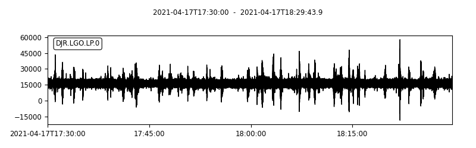
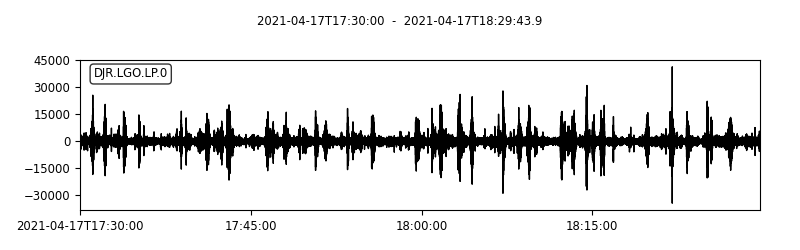
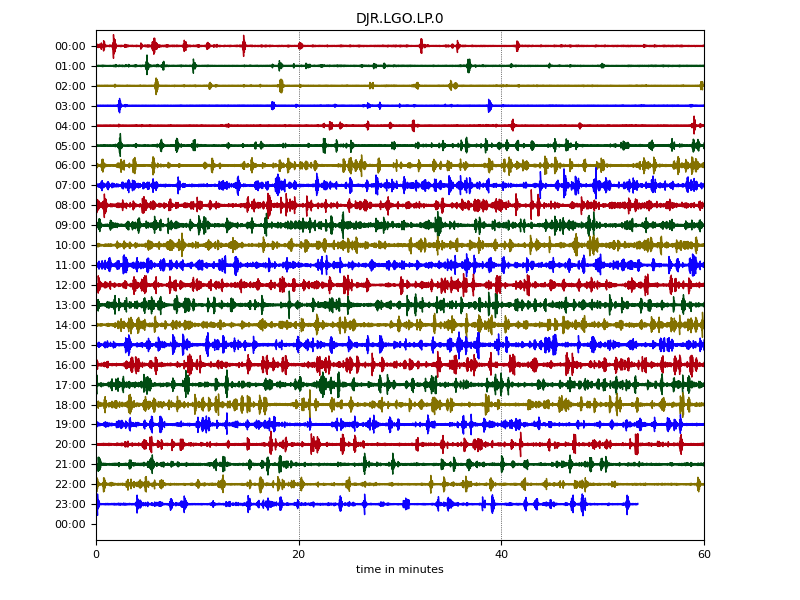
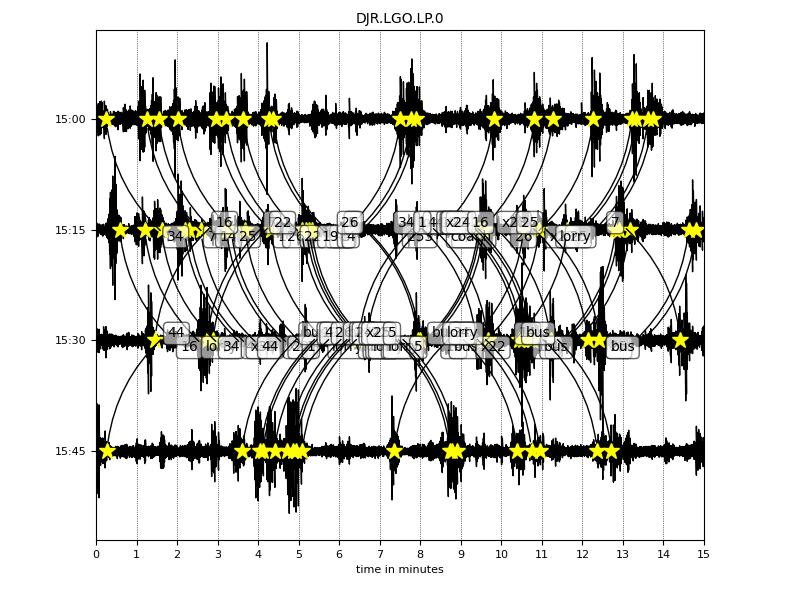
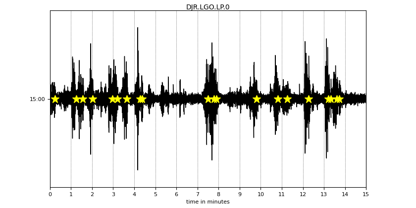

# Legomometer

The old building that I live in is shuddering noticeably every time a bus or heavy vehicle goes past, due to the poor state of the road outside. It's got to the point that I and other residents want the local council to do something about it, so I decided to indulge in a bit of citizen science to make our argument more persuasive.

Looking for ways to measure vibrations within my flat, I explored several options:

- Apps that use a phone's inbuilt accelerometer, eg [Vibration Meter](https://play.google.com/store/apps/details?id=kr.sira.vibration)
- Accelerometers connected to Arduino or Raspberry Pi eg [Raspberry Pi Sense Hat](https://www.raspberrypi.org/products/sense-hat/)
- [Raspberry Shake](https://raspberryshake.org/)
- [Slinky seismometer](https://www.instructables.com/DIY-Seismometer/)

Eventually I found this great kit for a [Lego seismometer](https://mindsetsonline.co.uk/shop/lego-seismometer-kit/) from [Mindsets UK](https://mindsetsonline.co.uk/).

I mean **science** *and* **Lego** --- what could be better?

Well how about a Raspberry Pi interface and datalogger thrown in for free? A discount code on the Mindsets website let me add the [SeismicPi](https://mindsetsonline.co.uk/shop/seismicpi/) board for free with a purchase of the Lego seismometer (or their more dramatic [slinky seismometer kit](https://mindsetsonline.co.uk/shop/slinky-seismometer-kit/)). This was a fantastic deal and turned out to be the perfect solution -- though not without a bit of work. Read on ...

## About the seismometer

The kit was designed for use with the [British Geological Survey](https://www.bgs.ac.uk/)'s *UK Schools Seismology Project* which ran from 2006-2019. It is a kit of genuine Lego bricks with some additional non-Lego parts to make a working seismometer capable of detecting vibrations from about 1 Hz up to 25 Hz. The design is basically a spring-loaded and counterweighted horizontal arm holding a powerful magnet floating within a fixed wire coil. When the seismometer is vibrated, the momentum of the counterweight holds the magnet in place while the coil moves up and down past it and generates a tiny electric current that can be measured.

The bundled SeismicPi interface connects to the coil to amplify the tiny electrical signal and digitise it into measurements that can be read by a computer. It does this by sampling the coil's voltage many times a second and converting those voltages into numbers that can be plotted against time to create a waveform. The principle is very much like that used to record sound into a computer from a microphone - in fact some seismometers use a device called a *geophone*!

## Building the Legomometer

The kit arrived quickly and was very easy to assemble using the included instructions. It's not the last word in sophisticated Lego design, but it gets the job done using a relatively small number of parts, and the non-Lego components are cleverly worked into the model. I particularly liked the use of a perfectly-sized tiny magnet pressed into the base of a single round stud, and the way that the sprung steel plate is held securely in place while still allowing it to be adjustable. The ready-made hinge pieces were a nice touch - it would have been very difficult to get exactly the right spacing, otherwise.

The custom-made coil assembly is shaped to press fit onto the Lego baseplate, but my one doesn't stay on very firmly and is easy to pull out of position - I might have to use a bit of glue (shh, don't tell) to fix it in place. The supplied cable plugs into the coil assembly using a normal 3.5mm headphone jack. The counterweight is just a heavy flat plate of steel resting on top of the arm, and you slide it forward or backward to adjust until the magnet is just floating at the right height within the coil --- it's a simple and intuitive design. To finish things off, a nice, clear acrylic dome sits over the whole instrument to protect it from air movements.

The whole thing takes about 30 minutes to put together and, when finished, is a compact and reasonably portable device. The dayglo orange, purple and black colour scheme takes a bit of getting used to, though!

I have christened it "**The Legomometer**"

## Initial testing

As recommended in the instructions, I hooked up the seismometer cable to the first set of terminals on the SeismicPi board, connected the board to my computer with a microUSB cable and downloaded the *[jAmaSeis](http://www.iris.edu/hq/jamaseis/)* software. After a bit of fiddling, I got it to work and I was recording a nice trace that jumped up and down satisfyingly every time I tapped the desk, walked up and down nearby, or even coughed. It certainly has the potential to be a very sensitive device - it has even been used to [measure "football-quakes"](https://mindsetsonline.co.uk/2018/11/26/what-do-lego-bricks-mars-football-have-in-common/) generated in a 0.5km distant football stadium when the home team scored a goal!

## Positioning the seismometer to measure building vibration

For my actual measurements, I needed to think carefully about where to site the seismometer. I live in a first-floor flat, so I couldn't simply place the device on the ground surface. The building has suspended wooden floors that are quite bouncy --- if I placed the seismometer on the floor (or on a table standing on the floor), it would dramatically amplify the building vibrations that I was trying to measure, but it would also amplify unwanted signals made by people moving around inside the flat: footsteps, doors closing, loud voices etc.

So instead, I placed the seismometer on the stone mantle in our sitting room. This is firmly fixed to the chimney stack that runs right from ground level up through the building. I thought that the solid masonry of the chimney stack would transmit ground vibrations up to the seismometer very effectively, while the momentum of such a large mass of stone and brick would reject any small-scale local vibrations from nearby movement in the flat. This seemed to work very well --- in tests, I could definitely see the seismometer responding to buses driving past in the street, while the movements of people in the room didn't register.


## Recording the measurements

The sitting room mantlepiece isn't a very convenient place to set up a computer for taking long-term measurements! Fortunately, the SeismicPi interface can also log its measurements to a memory card without needing to be tethered to a computer. Getting this working was a surprisingly difficult process (to avoid getting too technical here, I'll describe all the gory details in another article). In general, I recommend sticking with recording direct to a computer using the *jAmaSeis* software if you can. But with a bit of trial and error and some Python programming knowledge it is possible to get the datalogging working if you need it. I was able to set scheduled start and stop times for each sampling run, so I could simply leave the seismometer running for a day at a time and then examine the captured data at my leisure. A standard microSD memory card would have enough capacity for many months of data if necessary (though see my points about timing below).

## Visualising the data

If you are using *jAmaSeis*, then there's not much to do to display the data --- the main screen shows the trace as it's being recorded, and there are only a few restricted controls for formatting it before you capture an image using a screenshot. I wanted a bit more control over the final results than that, because I was going to use them in a published report.

The data logged to the memory card on the SeismicPi is in a special format that needs to be converted into something more useful by a script written in the Python programming language. Starting with this, I have been extending and building a set of Python tools for analysing and displaying the data from the SeismicPi in a more useful form. These tools will shortly be available on my [GitHub site](https://github.com/scripsi/legomometer). They rely on a very helpful Python library called *[ObsPy](https://github.com/obspy/obspy/wiki)*, which has been written especially for analysing seismometer data. A basic plot from *ObsPy* looks like this:



While you can see spikes in the trace due to vibration, there is a lot of noise in the basic signal, which hides some of the smaller spikes, and the values are offset from zero. The offset is just due to a small DC voltage in the measurement circuit and is easy to correct for. The noise is mainly due to the large amount of amplification being used to detect the seismometer's signal --- it also amplifies unwanted electrical interference --- but this is also easy to remove using a bandpass filter. *ObsPy* can treat the measurements a bit like a sound wave and filter out frequencies that are too high or too low to be of interest. After filtering and correcting the offset, the same plot looks like this:



The spikes caused by the vibrations are now much more distinct.

!!! info
    Note that if you are using jAmaSeis you can achieve a similar chart to the one above by doing the following:
    
    [File] -> [Settings] -> [Stream View tab] -> Number of helicorder lines: **1** -> [OK]

    [Scale Data] (in bottom right corner of screen):

    - Filter Data: **Enable**
    
    - Low-Pass Period Seconds: **1** 
    
    - Offset: (adjust until trace is centred on blue axis)
    
    - Amplitude Magnification: (adjust until trace is a reasonable size)

It's important to understand that the values on the Y-axis of these plots are not particularly meaningful --- they are simply counts representing voltage measurements on a scale that depends upon the particular physical and electrical characteristics of the seismometer and how it has been set up. To convert them into real-world units would require a very difficult [calibration process](https://streckeisen.swiss/assets/downloads/seismic-sensors-and-their-calibration.pdf), which I am not equipped to do! Nevertheless, the plots are still useful for showing, qualitatively, the frequency, timing and relative severity of vibrations. You can see this more clearly with a whole day's worth of data:



In the early morning, there were few noticeable vibrations, as very little traffic was driving past the building (only the occasional night bus). The vibrations increased as the morning rush-hour got going, remained at a relatively steady level throughout the day, then subsided again in the late evening.

## Timing issues

I wanted to go further than just showing that the vibrations were there, by trying to link the spikes on the chart with observations of individual vehicles passing the building. To do that, I would have to accurately synchronise the timing of my observations with the timing of measurements made by the seismometer. But there was clearly a problem with the time-keeping of the data logged by the SeismicPi board.

Look carefully at the full day plot above: I had set the board to record data for a full day between 00:00:00 and 23:59:59, but the trace stops short on the last line by a few minutes. After a bit of testing I realised that this was because the board was using a slightly slower sample rate than I was expecting. I had asked it to take samples 50 times every second, but due to a slight timing error in the hardware of the board it was only taking 49.77193 samples per second. Over the course of a full day, that slight error compounded into 19,700 (about 6.3 minutes worth) fewer samples than expected! Once I had realised this, I was able to adjust the sample rate in *ObsPy* to compensate and make sure that the timing was correct.

Another, smaller timing issue was caused by the Real-Time Clock (RTC) on the SeismicPi board. This is a separate, battery-powered timer which maintains the current date and time, and which is used to trigger the start and finish of each measuring session. This clock was also not terribly accurate, running fast by a few seconds per day. For the measurement durations that I was using (up to 24 hours) this wasn't too much of a problem --- I simply reset the clock just before each measurement session --- but it could be an issue when taking measurements over longer periods of weeks or months.

## Recording the traffic

Having compensated for the timing issues with the seismometer, I needed to find a way to record the passing traffic to a similar precision. It only takes a few seconds for a vehicle to pass our building and hit the potholes that are causing the vibrations, so I would have to note the time of each passing bus or lorry accurate to a second or two. I couldn't do this by just glancing at a watch and writing down the time.

I thought a phone app might help me --- most modern electronics match their clocks to a central, Internet time source, so if I set the seismometer to the time on my computer before each measurement run, I could be confident that it would be pretty well synchronised with the time on my phone. Unfortunately, although there are plenty of apps for tracking working time, they tend to only record to the nearest minute so are not accurate enough. Interval timer and stopwatch apps don't record the time of day, only the interval since the start, and they don't easily let you label each measurement. There may be a useable app out there, but I couldn't find it.

In the end I wrote a little script to run in a really useful Linux emulation app called [Termux](https://termux.com/). The script just let me type in a brief description of an approaching vehicle and then recorded the time when I hit `enter` into a text file. Once I had got it running up on the wonderful [Planet Computers Gemini](https://www.www3.planetcom.co.uk/gemini-pda)  (which has a *real keyboard*), I was all set to go out and sit on a park bench opposite my building and record the passing buses. Here's an excerpt of the results:

```
Time                Description
...
2021-04-19T15:10:48 14
2021-04-19T15:11:15 coach
2021-04-19T15:12:15 26
2021-04-19T15:13:12 7
2021-04-19T15:13:18 x23
2021-04-19T15:13:36 25
2021-04-19T15:13:43 lorry
...
[numbers are bus services]
```

## Merging the data

Having taken care to match the timings of the two datasets, it was relatively easy to merge them into a single plot. *ObsPy* lets you add a list of events as markers on the plot, although if there are a lot of events, the labelling of them leaves something to be desired!



Removing the labels and limiting the chart to a single 15-minute period makes the relationship between vibrations and passing heavy traffic very clear:



## Next steps

So, using a simple, educational seismometer kit and a fair bit of time and programming effort, I have successfully demonstrated that passing buses and lorries cause the vibrations that can be felt in our building. This was enough for me to write up in a report and present it to the local council in the hope that they would make some improvements to the road and solve the problem!

There are plenty of ways in which this project could be extended, though. *ObsPy* can be used to detect when peaks in the trace go above a certain threshold level, making it possible to automatically count the frequency of vibration events. It would be interesting to see how these events are affected by bus timetable changes, local diversions, seasonal changes in traffic etc.

It would also be nice to see if measurements could be compared from different points within the building to see how the vibrations vary with height or distance from the road. To do that reliably might take a bit of Lego redesign, because at the moment it is too easy to displace the counterweight and magnets when moving the device around, and that will have an effect on the magnitude of electrical signals from the coil.

Finally, different types and sizes of vehicle may cause different magnitudes and durations of vibration, and it would be interesting to try and measure these differences. The newer, bigger hybrid buses with heavy batteries in them certainly seem to make the building shudder more as they pass, but it would be good to demonstrate that.

Unfortunately, it's clear that the one thing I *can't* do here is use the seismometer for measuring actual earthquakes! The amount of local, human-made vibration in my city-centre location would simply swamp any genuine seismic signals. Well, it's been fun to try, anyway.
