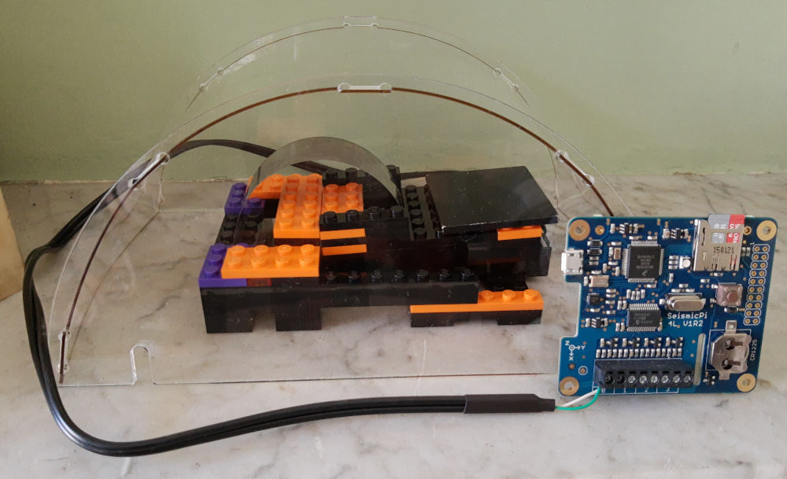

# Legomometer

The old building that I live in is shuddering noticeably every time a bus or heavy vehicle goes past, due to the poor state of the road outside. It's got to the point that I and other residents want the local council to do something about it, so I decided to indulge in a bit of citizen science to make our argument more persuasive.

Looking for ways to measure vibrations within my flat, I explored several options:

- Apps that use a phone's inbuilt accelerometer, eg [Vibration Meter](https://play.google.com/store/apps/details?id=kr.sira.vibration)
- Accelerometers connected to Arduino or Raspberry Pi eg [Raspberry Pi Sense Hat](https://www.raspberrypi.org/products/sense-hat/)
- [Raspberry Shake](https://raspberryshake.org/)
- [Slinky seismometer](https://www.instructables.com/DIY-Seismometer/)

Eventually I found this great kit for a [Lego seismometer](https://mindsetsonline.co.uk/shop/lego-seismometer-kit/) from [Mindsets UK](https://mindsetsonline.co.uk/).

I mean **science** *and* **Lego** --- what could be better?

Well how about a Raspberry Pi interface and datalogger thrown in for free? A discount code on the Mindsets website let me add the [SeismicPi](https://mindsetsonline.co.uk/shop/seismicpi/) board for free with a purchase of the Lego seismometer (or their more dramatic [slinky seismometer kit](https://mindsetsonline.co.uk/shop/slinky-seismometer-kit/)). This was a fantastic deal and turned out to be the perfect solution -- though not without a bit of work. Read on ...

## About the seismometer

The kit was designed for use with the [British Geological Survey](https://www.bgs.ac.uk/)'s *UK Schools Seismology Project* which ran from 2006-2019. It is a kit of genuine Lego bricks with some additional non-Lego parts to make a working seismometer capable of detecting vibrations from about 1 Hz up to 25 Hz. The design is basically a spring-loaded and counterweighted horizontal arm holding a powerful magnet floating within a fixed coil. When the seismometer is vibrated, the momentum of the counterweight holds the magnet in place while the coil moves up and down past it and generates a tiny electric current that can be measured.

The bundled SeismicPi interface connects to the coil to amplify the tiny electrical signal and digitise it into measurements that can be read by a computer. It does this by sampling the coil's voltage many times a second and converting those voltages into numbers that can be plotted against time to create a waveform. The principle is very much like that used to record sound into a computer from a microphone - in fact some seismometers use a device called a *geophone*!

## Building the seismometer

The kit arrived quickly and was very easy to assemble using the included instructions. It's not the last word in sophisticated Lego design, but it gets the job done using a relatively small number of parts, and the non-Lego components are cleverly worked into the model. I particularly liked the use of a perfectly-sized tiny magnet pressed into the base of a single round stud, and the way that the sprung steel plate is held securely in place while still allowing it to be adjustable. The ready-made hinge pieces were a nice touch - it would have been very difficult to get exactly the right spacing, otherwise.

The custom-made coil assembly is shaped to press fit onto the Lego baseplate, but my one doesn't stay on very firmly and is easy to pull out of position - I might have to use a bit of glue (shh, don't tell) to fix it in place. The supplied cable plugs into the coil assembly using a normal 3.5mm headphone jack. The counterweight is just a heavy flat plate of steel resting on top of the arm, and you slide it forward or backward to adjust until the magnet is just floating at the right height within the coil --- it's a simple and intuitive design. To finish things off, a nice, clear acrylic dome sits over the whole instrument to protect it from air movements.

The whole thing takes about 30 minutes to put together and, when finished, is a compact and reasonably portable device. The dayglo orange, purple and black colour scheme takes a bit of getting used to, though!

I have christened it "**The Legomometer**"

## Initial testing

As recommended in the instructions, I hooked up the seismometer cable to the first set of terminals on the SeismicPi board, connected the board to my computer with a microUSB cable and downloaded the [jAmaSeis](http://www.iris.edu/hq/jamaseis/) software. After a bit of fiddling, I got it to work and I was recording a nice trace that jumped up and down satisfyingly every time I tapped the desk, walked up and down nearby, or even coughed. It certainly has the potential to be a very sensitive device - it has even been used to [measure "football-quakes"](https://mindsetsonline.co.uk/2018/11/26/what-do-lego-bricks-mars-football-have-in-common/) generated in a 0.5km distant football stadium when the home team scored a goal!

## Positioning the seismometer to measure building vibration

For my actual measurements, I needed to think carefully about where to site the seismometer. I live in a first-floor flat, so I couldn't simply place the device on the ground surface. The building has suspended wooden floors that are quite bouncy -- if I placed the seismometer on the floor (or on a table standing on the floor), it would dramatically amplify the building vibrations that I was trying to measure, but it would also amplify unwanted signals made by people moving around inside the flat: footsteps, doors closing, loud voices etc.

In the end, I placed the seismometer on the stone mantle in our sitting room. This is firmly fixed to the chimney stack that runs right from ground level up through the building. I thought that the solid masonry of the chimney stack would transmit ground vibrations up to the seismometer very effectively, while the momentum of such a large mass of stone and brick would reject any small-scale local vibrations from nearby movement in the flat. This seemed to work very well - in tests, I could definitely see the seismometer responding to buses driving past in the street, while the movements of people in the room didn't register.

## Recording the measurements

The sitting room mantlepiece isn't a very convenient place to set up a computer for taking long-term measurements! Fortunately, the SeismicPi interface can also log its measurements to a memory card without needing to be tethered to a computer. Getting this working was a surprisingly difficult process (to avoid making this article too technical, I'll describe all the gory details in another post). In general, I recommend sticking with recording direct to a computer using the jAmaSeis software if you can. But with a bit of trial and error and some Python programming knowledge it is possible to get the datalogging working if you need it. I was able to set scheduled start and stop times for each sampling run, so I could simply leave the seismometer running for a day at a time and then examine the captured data at my leisure. A standard microSD memory card would have enough capacity for many months of data if necessary (though see my points about timing below).

## Visualising the data

If you are using jAmaSeis, then there's not much to do to display the data --- the main screen shows the trace as it's being recorded, and there are only a few restricted controls for formatting it before you capture an image using a screenshot. I wanted a bit more control over the final results than that, because I was going to use them in a published report.

The data logged to the memory card on the SeismicPi is in a special format that needs to be converted into something more useful by a script written in the Python programming language. Starting with this, I have been extending and building a set of Python tools for analysing and displaying the data from the SeismicPi in a more useful form. These tools will shortly be available on my [GitHub site](https://github.com/scripsi/legomometer). They rely on a very helpful Python library called [ObsPy](https://github.com/obspy/obspy/wiki), which has been written especially for analysing seismometer data.
