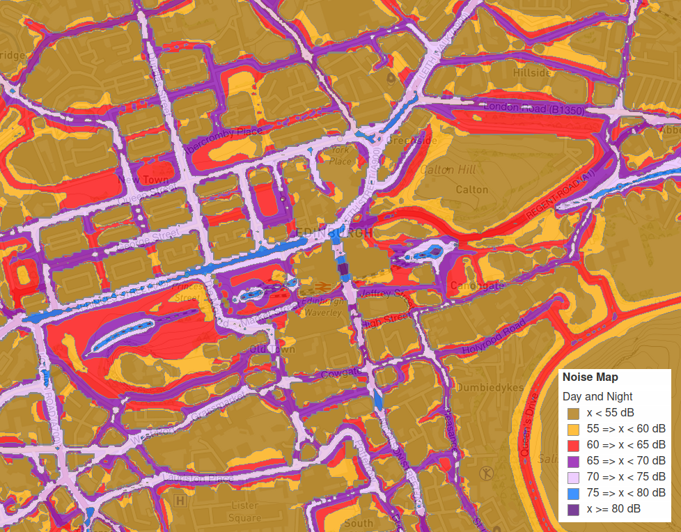

# Measuring Noise

Cities are noisy places — I know, because I live in the middle of one — but what is _unreasonable_ noise? That was the question I wanted to try and answer for residents of a nearby street who were being woken up in the early mornings by the noise of buses leaving a depot to reach the start of their routes. I had to find a way to measure noise to a reasonably high standard using cheap and relatively simple equipment, but that turned out to be the easy bit. Much more difficult was then understanding what I had measured and demonstrating what it meant. I'm still not sure if I've succeeded, but read on and see what _you_ think!

## What is noise?

At a physical level, sound is simply pressure waves travelling through a fluid (air or water). When those pressure waves reach us, they are converted into nerve signals by the structures in our ears, and our brains interpret those signals into what we experience as sounds. Human ears have an amazing range of sensitivity — there is roughly a million times difference in sound pressure between the quietest sounds that we can hear and the loudest sounds at the threshold of pain. As well as the magnitude of the pressure waves, our ears can sense their frequency and also the direction they are coming from, allowing us to experience the soundscape around us in exquisite detail. But beyond those purely physical aspects, the interpretation of sounds by our brains creates a more subjective experience. Sounds can sooth or startle, be pleasurable or painful, attract or annoy.

The word "noise" usually means sounds that are negative or undesirable in some way, but that definition still allows for a broad range of interpretation. Irritating noises can be quiet (a dripping tap) or loud (a backfiring car exhaust), they can vary in frequency (the high-pitched whine of a fan or the thumping bass from a nightclub), they can be continuous (the roar of a nearby motorway) or intermittent (passing cars on a quiet street). Whether or not a particular noise negatively affects someone can depend on who they are, what they are expecting, how close the noise is, and even what time of day it is. A sudden sound in the dead of night might be enough to wake someone up, while that same person might not even notice an identical sound during the daytime.

Finding a way to wrap all that complexity up into a single definition of "noise" and then measure it might seem like an impossible task, but in the early 2000s the European Union decided to try ...

## The END of noise

In response to a World Health Organisation report about the negative health impacts of noise, the European Parliament passed the Environmental Noise Directive (END). This required member states to consider the impacts of noise on people and take steps to mitigate those impacts where they were excessive. It created a framework for how authorities should determine, communicate and reduce the effects of environmental noise. In Scotland, the result was a website, [Scotland's Noise](https://noise.environment.gov.scot/index.html), which maps the expected noise levels in the main population centres ("agglomerations") across the country. Here's what it looks like for central Edinburgh, where I live:

My home lies in a red-shaded area of the map, so it looks like I should experience noise levels of between 60 and 65 dB, but what does that actually mean? Well, the [FAQ section of the website](https://noise.environment.gov.scot/frequently-asked-questions.html) does a pretty good job of explaining how they made the map. They did _not_ send out an army of people to measure sound levels on every street corner over a long period! Instead, they fed existing data on things like traffic, public transport, industrial sites, building locations and population density into a mathematical model that would predict the expected environmental noise level at any point. The model divided the area up into 10m squares and predicted _Leq_ (_equivalent continuous sound pressure level_) at a point 4m above the ground in the centre of each of those squares. The noise contours on the map are then calculated from those predictions.

So the map shows the average noise level I should _expect_ to experience in a particular location on a typical day (provided I happen to be floating 4m above ground level, of course). That's relatively straightforward, but how useful is it?

This next bit gets rather mathematical, so feel free to skip past it if you're not that way inclined, but it does help to explain why thinking about sound levels is not straightforward.

## What the L?

First, I need to fully understand how sound pressure levels are defined. The sound pressure level (_L~p~_) at any moment is expressed as a ratio of the pressure at that moment(_P_) with a baseline pressure level (_P~0~_): 

$$
L_p = \frac{P}{P_0}
$$
For noise measurement purposes, _P~0~_ is taken to be 20 $\mu Pa$, which is about the lowest pressure level that human ears can detect. I mentioned before that the human ear can deal with sound pressure levels varying by a million times between the quietest and loudest sounds, so this pressure ratio can be anywhere from 1 to 1,000,000 or more.

People don't really cope well with large number ranges, so sound pressure ratios are usually converted to a logarithmic form (_L_) measured in Bels (B — named in honour of Alexander Graham Bell). On that scale, 0 B is the quietest sound a human can detect, while 12 B is getting painfully loud. For some reason, it was then decided that Bels were too big and it was better to express measurements in tenths of a Bel, or deciBels (dB):
$$
L = Log_{10}\left(\frac{P}{P_0}\right) B = 10 Log_{10}\left(\frac{P}{P_0}\right) dB
$$
Here are some examples of approximate sound levels:

| Sound                       | Pressure   | Bels | Decibels |
| --------------------------- | ---------- | ---- | -------- |
| Threshold of hearing        | 0.00002 Pa | 0 B  | 0 dB     |
| Leaves rustling, whispering | 0.0002 Pa  | 2 B  | 20 dB    |
| Quiet room                  | 0.002 Pa   | 4 B  | 40 dB    |
| Normal conversation         | 0.02 Pa    | 6 B  | 60 dB    |
| Heavy traffic               | 0.2 Pa     | 8 B  | 80 dB    |
| Motorbike                   | 2 Pa       | 10 B | 100 dB   |
| Rock concert                | 20 Pa      | 12 B | 120 dB   |
| Balloon popping             | 200 Pa     | 14 B | 140 dB   |
| Jet engine                  | 2000 Pa    | 16 B | 160 dB   |

## Raising L

While the logarithmic dB scale makes the numbers easier to write down, it ends up making calculations using dB measurements much more difficult. You can't simply add, subtract, multiply or average dB values. To appreciate why, consider a car passing you on a quiet road – the noise it makes might reach, say, 80 dB as it goes past. Now consider what happens if another car passes you in the opposite direction at the same time. Is the noise level $80 + 80 = 160 dB$? That is the noise equivalent of standing right next to a jet engine, which is clearly not comparable!

To do any calculations with decibels, you first have to convert them into sound pressure ratios, perform your calculation, and then convert the result back into decibels again. So in the passing cars example above, if the sound levels from the two cars are called _L~1~_ and L_~2~_ the calculation would be:
$$
\begin{align*}
L_1 + L_2 &= 10 Log_{10}\left(10^\left(\displaystyle \frac{L_1}{10}\right) + 10^\left(\displaystyle \frac{L_2}{10}\right)\right) dB \\
80 dB + 80 dB&= 10 Log_{10}\left(10^\left(\displaystyle \frac{80}{10}\right) + 10^\left(\displaystyle \frac{80}{10}\right)\right) dB \\
& = 83 dB
\end{align*}
$$
What a palaver! Nevertheless, you can see that the sound level of two 80 db noises added together is only slightly larger, at a more realistic 83 dB, and not the overestimate of 160 dB you get from simply adding the dB values together.

The same thing is true if you want to average a series of sound level measurements taken over a time period. A simple arithmetic mean of decibel values isn't useful because of the logarithmic scale, so instead you need to calculate _L~eq~_ or the "equivalent continuous sound level", by converting all the decibel values to sound pressure ratios, averaging them, and then converting the result back into a decibel value again. For a series of _n_ measurements, _L~1~_ to _L~n~_:
$$
L_{eq} = 10 Log_{10}\left(\frac{10^\left(\displaystyle \frac{L_1}{10}\right) + 10^\left(\displaystyle \frac{L_2} {10}\right) + ... + 10^\left(\displaystyle \frac{L_{n-1}}{10}\right) + 10^\left(\displaystyle \frac{L_n}{10}\right)}{n}\right) dB
$$
_L~eq~_ is the closest you can get to an "average" sound level — it is the theoretical constant sound level that would create the same total sound pressure as the actual variable measurements taken over the sample period. Strictly speaking, you also need to specify the time period over which the measurements have been taken, so, for example, _L~eq~,1h_ is the equivalent continuous sound level over a sample period of 1 hour.

## One L of a day

The Environmental Noise Directive promotes the use of a statistic called _L~DEN~_ which is designed to encapsulate the effects of noise over a whole day. It is made up of three _L~eq~_ measurements over different daily time periods, which have different "penalties" assigned to them:

|              | Start | End   | Duration | Penalty |
| ------------ | ----- | ----- | -------- | ------- |
| _L~day~_     | 07:00 | 19:00 | 14 hours | +0 dB   |
| _L~evening~_ | 19:00 | 23:00 | 4 hours  | +5 dB   |
| _L~night~_   | 23:00 | 07:00 | 8 hours  | +10 dB  |

Once again, we have to do the same logarithmic conversions when calculating _L~DEN~_, so the full formula looks like this:
$$
L_{DEN} = 10 Log_{10}\left({\frac{14}{24}10^\left(\displaystyle \frac{L_{day}}{10}\right) + \frac{4}{24}10^\left(\displaystyle \frac{L_{evening}+5} {10}\right) + \frac{8}{24}10^\left(\displaystyle \frac{L_{night}+10}{10}\right)}\right) dB
$$
Finally I have a single number that is supposed to express the level of environmental noise in a particular location over the course of a whole day. In fact, the noise map that I included earlier is showing the predicted _L~DEN~_ levels for the different points on the map. To check if the map is realistic for any location, I just need to make three measurements of noise over different daily time periods and feed them into this formula.

## Practical noise measurement on a budget

Professional integrating sound pressure level meters, that can log noise levels over time, cost many hundreds or even thousands of pounds — well beyond the means of my simple project. Much cheaper, simpler devices are available that can give reasonably accurate spot measurements of noise levels, and I was able to modify one of these to allow me to log the measurements over time. The full details of the "PicoDeeBee" meter will be available on my [GitHub page](https://github.com/scripsi), but in essence it is a cheap, generic model of decibel meter adapted to provide an output to a tiny microcontroller that records the timestamped data to a spreadsheet file which can be downloaded over USB. The total cost of the components is about 35 GBP.

The sound meter measures A-weighted (i.e. tuned to the same frequency sensitivity as the human ear) sound pressure levels and converts them to decibel readings at a rate of 6 times per second. These decibel levels are output as a voltage which is detected and recorded by the microprocessor. Because of limited storage space, I've programmed the microprocessor to calculate the equivalent continuous sound level from the combined individual readings over the course of a minute, and save _L~eq~,1 min_ measurements to the data file. It also records the maximum and minimum sound readings, _L~max~_ and _L~min~_, for each minute. A battery-backed clock ensures that the timestamps of each measurement are reasonably accurate. Set up like this, the meter can be left running for days or weeks at a time before the data are copied off and analysed.

For testing, I simply set up PicoDeeBee next to an open window in my flat and left it running for a total of about two weeks to record the noise levels on my street. Since my flat is on an upper floor, the position of the meter roughly matched the 4m height used in the noise mapping, and so it should enable a useful comparison with with the modelled data.

## Looking at the test data

Above is a plot of a typical weekday's data. The first thing to notice is how … er … "noisy" it is. The sound levels vary wildly over time, even when averaged over minute-long periods. The minimum and maximum sound levels for each minute are also very variable. Now have a look at the next plot:

This is 4 week's worth of data combined and summarised using the techniques described above. The  _L~eq~,1 min_ line still has a fair bit of variation, but it is now possible to pick out some general trends: the relative quiet of the early morning is lost from around 5-6am as the traffic of the morning rush-hour rises to peak at about 8am and then the noise level stays relatively steady through the rest of the day before tailing off slightly in the late evening.

The horizontal lines on the graph show the corresponding _L~day~_, _L~evening~_, and _L~night~_ values calculated from the data, as well as the combined _L~DEN~_ measurement used in the END mapping. Here are the exact figures:

|              | Start | End   | Duration | Penalty |
| ------------ | ----- | ----- | -------- | ------- |
| _L~day~_     | 07:00 | 19:00 | 14 hours | +0 dB   |
| _L~evening~_ | 19:00 | 23:00 | 4 hours  | +5 dB   |
| _L~night~_   | 23:00 | 07:00 | 8 hours  | +10 dB  |

## Finding the bin lorry in the haystack

Most mornings, at some time between 6am and 7am, there is a noisy lorry that comes along my street to empty rubbish bins. It wakes me up so often, I've started calling it my morning [Reveille](https://www.youtube.com/watch?v=8r5Ieh0OuQY). If I can demonstrate the effect of the morning bin lorry in the test data, then I should be able to do the same for the residents on the bus-blighted street.

Well, looking at the graphs above, can _you_ spot the bin lorry noise?

No, I can't either.

The huge amount of minute-to-minute variation in the _L~eq~_ values swamps any daily trends, and hides the specific noise events I'm looking for.

So if I can't even spot the bin lorry that wakes me up in my test data, how can I demonstrate the effects of the passing buses for the bleary-eyed people in the street nearby?

Perhaps the issue is that I've been trapped into thinking about _average_ noise over long periods in the same way as the END maps consider it.  But the sorts of sounds that might wake a person up tend to be sudden and changeable, rather than continuous and average.

Unfortunately, even looking at the minimum and maximum sound levels doesn't really help. The  _L~min~_ levels show that the noise floor is definitely quieter at night, but what is perhaps surprising is how high the  _L~max~_ levels can be right through the nighttime and early morning. Noise events of 80 and even 90 dB can apparently happen at any time of night and yet somehow I manage to sleep through them! I still can't see the effect of the bin lorry that actually wakes me up, though.
